# Pool Controller — Wiring Document

Controller: **Waveshare ESP32-S3-ETH-8DI-8RO** (ESPHome)
Switching: **4× Omron G7L-2A-BUBJ-CB** (24 VDC coil): 3 for 240 V loads + 1 for valve-actuator 24 VAC isolation · **2× Hayward + 2× Tork** 3-wire 24 VAC reversing valve actuators
Power: **24 VDC** (Mean Well HDR-30-24) for board + G7L coils · **24 VAC** (Functional Devices TIB40A, 40 VA DIN-rail Class 2) for actuators
Feed: **120 V** branch from existing breaker panel

---

## Overview diagram

```mermaid
flowchart TD
    %% ---------- Power sources ----------
    subgraph POWER["Power sources"]
        FEED120["120V Control Feed (panel)"]
        FEED240["240V Load Feed (panel, already wired)"]
        PSU["24VDC PSU (HDR-30-24)"]
        XFMR["24VAC Transformer (TIB40A 40VA DIN)"]
    end
    FEED120 -->|"14 AWG tap"| PSU
    FEED120 -->|"14 AWG tap"| XFMR

    %% ---------- Controller ----------
    PSU -->|"24VDC in"| BRD["Waveshare ESP32-S3 Controller"]

    %% ---------- G7L relays (each = one physical relay: coil + 2-pole contacts) ----------
    subgraph G7LS["G7L power relays"]
        G1["G7L #1"]
        G2["G7L #2"]
        G3["G7L #3"]
        G4["G7L #4"]
    end
    BRD -->|"Relay 1 (EXIO1) drives coil"| G1
    BRD -->|"Relay 2 (EXIO2) drives coil"| G2
    BRD -->|"Relay 3 (EXIO3) drives coil"| G3
    BRD -->|"Relay 4 (EXIO4) drives coil"| G4
    PSU -.->|"24VDC coil supply"| G1 & G2 & G3 & G4
    FEED240 --> G1 & G3 & G4

    %% ---------- Pool equipment (one block per device) ----------
    subgraph EQUIP["Pool equipment"]
        PUMP["IntelliFlo3 pump"]
        PC100["PC100 + Plus60 chlorinator"]
        BOOST["Polaris booster pump"]
        BLOW["Polaris blower"]
    end
    G1 -->|"240V switched"| PUMP & PC100
    G3 -->|"240V switched"| BOOST
    G4 -->|"240V switched"| BLOW

    %% ---------- RS485 daisy chain (controller mid-bus) ----------
    PUMP -->|"RS485 Green/Yellow (120R at pump)"| BRD
    BRD -->|"RS485 Green/Yellow (120R at PC100)"| PC100

    %% ---------- JVA valve actuators ----------
    subgraph VALVES["Valve actuators (Hayward/Tork, 24VAC reversing)"]
        V1["Valve 1"]
        V2["Valve 2"]
        V3["Valve 3"]
        V4["Valve 4"]
    end
    BRD -->|"Relay 5 (NC/NO dir)"| V1
    BRD -->|"Relay 6 (NC/NO dir)"| V2
    BRD -->|"Relay 7 (NC/NO dir)"| V3
    BRD -->|"Relay 8 (NC/NO dir)"| V4
    XFMR -->|"24VAC, both legs"| G2
    G2 -->|"switched ACH/ACC"| V1 & V2 & V3 & V4

    %% ---------- Sensors + network ----------
    BRD -->|"1-Wire GPIO21 + 4.7k (shared bus)"| TEMP["DS18B20 outdoor/ambient temp"]
    BRD -->|"same 1-Wire bus"| WTEMP["DS18B20 water temp (between pump & filter)"]
    BRD -.->|"WiFi 2.4GHz via SMA antenna"| NET["Home Assistant / LAN"]
```



---

## Physical layout — DIN rail & wiring

**Rail load order (left → right).** Keep the mains/primary end (incoming 120 V, PSU + transformer primaries) grouped at one end, away from the controller / RS485 / signal end, so 120 V stays separated from low-voltage signal.

| Pos | Rail item | Zone |
|--:|---|---|
| 1 | Incoming **L / N** terminal blocks | mains 120 V |
| 2 | **HDR-30-24** 24 VDC PSU | power |
| 3 | **TIB40A** 40 VA transformer | power |
| 4 | **Waveshare** controller | signal |
| 5 | Distribution blocks **DC+ / DC− / ACH / ACC** | low-voltage |
| 6 | **End clamps** | — |

> Off-rail: the **existing PE ground block** (reused from the Hayward case), the **G7L relay bank** (4×, bolted to the back panel), and all **field** devices (240 V loads, valve actuators, RS485 devices, temp probe).

Panel plan-view (inside of the enclosure, mains end on the left → signal end on the right):

```text
DIN RAIL  (35 mm)
┌──────┬──────────┬─────────┬────────────┬──────────┐
│ L/N  │HDR-30-24 │ TIB40A  │ Waveshare  │DC/AC dist│
│  in  │ 24V PSU  │40VA xfmr│ controller │ACH/ACC   │
└──────┴──────────┴─────────┴────────────┴──────────┘
└─ mains ─┘ └───── power ─────┘ └── signal / low-voltage ──┘

BOLTED TO PANEL (already mounted, off-rail):
┌──────────┐ ┌──────────┐ ┌──────────┐ ┌──────────┐
│  G7L #1  │ │  G7L #2  │ │  G7L #3  │ │  G7L #4  │   25 A 2-pole
│pump+PC100│ │valve pwr │ │  booster │ │  blower  │   24 Vdc coil
└──────────┘ └──────────┘ └──────────┘ └──────────┘

CABLE ENTRY (bottom glands):  [120V in]  [240V loads]  [RS485]  [valves 24Vac]
```

> A **to-scale, dimensioned** version of this layout (device widths in mm, zone colours, scale bar) is in [panel-layout.svg](panel-layout.svg) — open it in VS Code's SVG preview or a browser; it's printable as a planning drawing. Verify device dimensions against datasheets and your enclosure before drilling.

**Wire flow between zones** (terminal-level detail is in sections 1–8 below):

- `120 V L / N` → **PSU primary** and **transformer primary** (14 AWG taps; no inline fuses — see §1)
- PSU `24 VDC` → **DC+/DC− dist** → controller VIN/GND, and → G7L coils (switched by relays 1–4)
- Transformer `24 VAC` → both poles of **G7L #2** → **ACH/ACC dist** → valve actuators (direction set by relays 5–8; actuator JST XH pigtail leads land directly on the board relay screw terminals)
- Controller **RS485 A/B** terminals ↔ IntelliFlo3 and PC100 (field), daisy-chained with the controller mid-bus
- G7L contacts → **240 V loads** (field): G7L #1 powers pump + PC100 together; G7L #3 powers booster; G7L #4 powers blower

---

## Rail definitions

| Rail | Meaning | Source |
|---|---|---|
| **L120 / N120 / PE** | 120 V control feed | Breaker panel branch |
| **DC+ / DC−** | +24 VDC / 0 VDC | HDR-30-24 output |
| **ACH / ACC** | switched 24 VAC legs | TIB40A 40 VA secondary through G7L #2 (Class 2; transformer has a built-in breaker) |

Board relays are onboard **Form-C** channels (EXIO1–8), each with **COM / NO / NC**.

---

## 1. Mains / primary side (120 V)

**Fuseless (Hayward-style).** No inline primary fuses: rely on the **branch breaker** for the feed, the PSU's **internal input fuse + output OCP** on the 24 VDC side, and the **Class 2 transformer** on the 24 VAC side (the **TIB40A** also has its own built-in primary circuit breaker). Use **14 AWG** for the short 120 V taps so the branch breaker (≤20 A) protects them.

| From | To | Notes |
|---|---|---|
| L120 | **PSU L** | 14 AWG tap |
| N120 | **PSU N** | |
| L120 | **Transformer H** | 14 AWG tap; 40 VA/120 V ≈ 0.33 A |
| N120 | **Transformer N** | |
| PE | **Existing Hayward case ground block** → PSU PE, transformer frame, DIN rail, cable shields | Bond all metal to the reused block |

## 2. Low-voltage rails

| From | To |
|---|---|
| PSU **V+** | **DC+** block |
| PSU **V−** | **DC−** block |
| Transformer secondary leg 1 | **ACH** block |
| Transformer secondary leg 2 | **ACC** block |

*(24 VAC has no true polarity — keep ACH/ACC consistent everywhere. The 40 VA/24 V secondary is **Class 2 / energy-limited**, so no secondary fuse is required — the transformer self-limits a shorted/pinched actuator cable, and the actuator motors self-cut at their cam limits.)*

## 3. Board power

| Board terminal | Connects to |
|---|---|
| **VIN (7–36 V +)** | DC+ |
| **GND (−)** | DC− |

## 4. Relays 1–4 → G7L coils (pilot 24 VDC)

Jumper **DC+** to **COM** of relays 1–4. Use **NO** (fail-safe OFF).

| Ch | Wiring | G7L | Function |
|---|---|---|---|
| 1 | R1 COM ← DC+ · R1 **NO** → G7L#1 A1 · G7L#1 A2 → DC− | #1 | IntelliFlo3 pump |
| 2 | R2 COM ← DC+ · R2 **NO** → G7L#2 A1 · G7L#2 A2 → DC− | #2 | Valve-actuator 24 VAC master power |
| 3 | R3 COM ← DC+ · R3 **NO** → G7L#3 A1 · G7L#3 A2 → DC− | #3 | Polaris booster pump |
| 4 | R4 COM ← DC+ · R4 **NO** → G7L#4 A1 · G7L#4 A2 → DC− | #4 | Polaris blower |

- G7L DC coil is **non-polarized** (no internal diode) — A1/A2 orientation doesn't matter.
- Coil wiring: 18 AWG (~65 mA each).

**Behavior notes for these loads:**
- **IntelliFlo3 (Ch 1) loses RS485 comms when its relay is OFF.** A variable-speed pump is normally left powered and driven entirely over RS485. When switched by G7L#1, the pump won't answer RS485 until power is restored — ESPHome must **energize the relay first, then send speed commands** (and expect no comms while off).
- **PC100 shares G7L #1 with the pump.** Its 240 V feed is landed on the load side of the pump relay, providing a hardware chlorinator interlock independent of the ESP32.
- **G7L #2 is low-voltage only.** Use its two NO poles to interrupt both TIB40A secondary legs before the ACH/ACC distribution blocks. When G7L #2 drops out, every valve actuator is electrically disabled while the direction relays retain their commanded states.
- **Confirm each load's voltage/current.** The G7L-2A breaks both poles at 25 A/250 VAC. Verify the **Polaris blower** is 240 V vs 120 V — if 120 V it needs only one switched leg (you can still use the 2-pole relay: land L + N, or switch L and leave the second pole unused).

**G7L contacts:** #1, #3 and #4 use both poles to break L1/L2 of their 240 V loads. #2 uses both poles for the isolated 24 VAC transformer secondary and must not be connected to a 240 V load. The board only drives the coils.

## 5. Relays 5–8 → JVA actuators (24 VAC reversing)

Route TIB40A secondary leg 1 through one G7L #2 NO pole to **ACH**, and secondary leg 2 through the other G7L #2 NO pole to **ACC**. Jumper switched **ACH** to **COM** of relays 5–8. Each actuator **Black → ACC**.

| Ch | Wiring | Valve |
|---|---|---|
| 5 | R5 COM ← ACH · R5 **NC** → Red · R5 **NO** → White · Black → ACC | Valve 1 |
| 6 | R6 COM ← ACH · R6 **NC** → Red · R6 **NO** → White · Black → ACC | Valve 2 |
| 7 | R7 COM ← ACH · R7 **NC** → Red · R7 **NO** → White · Black → ACC | Valve 3 |
| 8 | R8 COM ← ACH · R8 **NC** → Red · R8 **NO** → White · Black → ACC | Valve 4 |

- De-energized → **Red** leg (fail-safe); energized → **White** leg.
- Reversed valve? Swap **NO↔NC** (or fix via cam / software).
- In normal and automatic operation G7L #2 is energized, supplying ACH/ACC. In Service Mode, the **Valve Actuator Power** switch may drop G7L #2 so a manually positioned actuator cannot drive itself back. Leaving Service Mode restores actuator power before automation resumes.
- Each actuator has a **3-pin JST XH** connector; mate it with a ready-made **JST XH pigtail** — **socket housing** on one end, pre-crimped **flying leads** on the other (widely sold on Amazon). Confirm the actuator connector's gender and buy the mating half. Land the pigtail leads on the board **by actuator pin function** — Red→**NC**, White→**NO** (relays 5–8) and Black→**ACC** dist block — then the actuator just plugs in. Confirm which JST pin is Red/White/Black before landing. No breakout board or carrier needed. Label each cable Valve 1–4.

### Pump basket service

1. Turn **Service Mode ON** and verify the pump has stopped.
2. Turn **Valve Actuator Power OFF** and verify G7L #2 has dropped out.
3. Set the sand-filter multiport to **Closed**.
4. Use the suction actuator's manual handle to close the pool/spa suction valve.
5. Open and clean the pump basket. Do not rely on software state alone before opening a below-waterline pump; confirm the valve cannot motor and water is isolated.
6. Refit and seal the pump lid, return the multiport to its operating position, and manually return the suction valve to a valid flow path.
7. Turn **Valve Actuator Power ON**, then turn **Service Mode OFF**. Leaving Service Mode also forces actuator power on before restoring automatic plumbing.

## 6. DS18B20 temperature probes (shared 1-Wire bus)

Two DS18B20 probes share **one** 1-Wire bus: an **outdoor/ambient** probe (freeze protection) and an **in-pipe water** probe (pool water temperature). DS18B20s are addressable, so both hang off the **same GPIO21 data line** with a **single 4.7 kΩ** pull-up — ESPHome tells them apart by their 1-Wire address.

| Bus signal | Board header | Both probes |
|---|---|---|
| VDD | **3V3** | both Red → 3V3 |
| GND | **GND** *(sensor header — not the DC− bus)* | both Black → GND |
| DATA | spare **GPIO21** *(verify free on 28-pin header)* | both Yellow → GPIO21 (paralleled) |
| pull-up | **4.7 kΩ** between **DATA and 3V3** | **one** resistor for the whole bus |

Wire both probes in parallel: land both Reds on 3V3, both Blacks on GND, both Yellows on GPIO21. Fit the **4.7 kΩ once** across DATA↔3V3.

**Outdoor/ambient probe.** Thread the **6 mm probe tube** down through the **bottom M12 gland** so the sensor tip hangs **outside and shaded** — this keeps it out of the sun-warmed metal box's radiant heat for true ambient readings. The gland clamps the 6 mm stainless tube (M12 range ~3–6.5 mm); the cable runs up to the board header.

**Water probe (between pump and filter).** Mount on the **pump discharge run — after the pump, before the filter inlet** (pressurized side), per the IntelliCenter install note: pick a convenient spot on a **straight length of pipe** (not on a fitting/elbow), drill a **3/8-inch hole in one side of the pipe**, and seat the probe so its tip contacts the moving water. Seal and clamp it (gasket + hose clamp / saddle) so it's watertight against system pressure. Route the cable back to the box through a **field gland** and land it on the shared 1-Wire bus above. Because this reading is only valid with water moving, treat it as **pump-on / flow-present** data in software (ignore or hold when the pump relay is OFF).

```text
pool ── suction ──▶ [PUMP] ──▶ ✚ water probe here ▶── [FILTER] ──▶ return to pool
                                (after pump, before filter)
```

## 7. RS485 (pump + chlorinator)

Pump: **Pentair IntelliFlo3**. Use standard **22 AWG** communication wire (no special cable). The IntelliFlo3 comm terminal uses **Green** and **Yellow** data ports — connect only those two.

Chlorinator: **Pentair IntelliChlor Plus60** (successor to the IC60; same IntelliChlor RS-485 protocol), powered by a **Pentair PC100 power center**. The Plus60 cell plugs into the PC100 for power; the **RS485 data pair lands on the PC100**, not on the cell. Its data terminals are also **Green / Yellow** (same convention as the pump).

| Board RS485 | Pump (IntelliFlo3) | Power center (PC100) |
|---|---|---|
| **A (D+)** | **Green** | **Green** |
| **B (D−)** | **Yellow** | **Yellow** |
| **GND** | Cable shield (tie one end only) | — |

**Topology — controller mid-chain, wires direct on the board.** Run a 22 AWG pair from each device back to the box and land **both pairs directly on the board's RS485 screw terminals** — both **Greens under A**, both **Yellows under B** (~2 wires per screw). No junction block: the terminal itself is the splice point, giving one linear bus with the controller as a mid-span node:

```
pump  ──pair──  [ Waveshare A / B terminals ]  ──pair──  PC100
                     (controller = mid-bus node)
```

Electrically this **is** a daisy chain (the join lives at the board terminals), so it's clean and serviceable. The board sits in the **middle** of the bus, not at an end.

- Green = A (D+), Yellow = B (D−). If there are **no comms** on first bring-up, **swap the pair** — RS485 A/B polarity is easy to reverse and swapping is harmless.
- **Pentair is 2-wire:** land only **DATA+ / DATA−** (Green/Yellow) at every node, exactly as the Pentair manuals show. A third signal-ground conductor is **optional** (the devices already share earth via AC ground) — only add it if you see intermittent errors. Keep the **shield** (grounded one end only) for noise immunity since the run passes the pump motor.
- The Plus60 cell itself connects only to the PC100 (its 4-pin cell cord); the automation bus taps the PC100.
- **Termination:** the two electrical ends are the **pump** and the **PC100** — enable/add **120 Ω** at each of those. Because the board is a **mid-bus node** here, **leave the board's onboard 120 Ω jumper OFF**.
- At residential length and ~9600 baud, termination is not critical — partial or no termination often works — but terminating the two far devices is the correct default.


## 8. Networking (WiFi)

| Board | To |
|---|---|
| WiFi 2.4 GHz | LAN / Home Assistant |
| **SMA antenna** | Mount **outside** the enclosure, waterproofed (see chain below) |

The RJ45 Ethernet port is **unused**. WiFi requires the external antenna (the board's "-1U" module has no PCB antenna).

**Waterproof antenna chain:**
```
Board SMA jack -- internal SMA pigtail (inside enclosure) -- panel/bulkhead-mount IP67 antenna (screws through wall, nut + gasket) -- radome outside
```
- The **antenna** is the through-wall part — its nut + gasket seal the hole; the pigtail stays **inside** the box and just plugs onto the antenna's internal connector.
- Match **SMA, not RP-SMA** (board is plain SMA female); match the pigtail genders to the board jack and the antenna's internal connector.
- Weatherproof any exposed outside joint with self-amalgamating tape; add a drip loop / point the connector down.

---

## Terminal-block schedule (DIN rail)

Every rail uses **one Phoenix Contact UT 2,5-3PV** (3214262) multi-level block: 3-level, **6 clamp points all internally bonded** (equipotential), 5.2 mm wide, 500 V / 19 A, 0.14–4 mm². L120/N120 use 3 of the 6 points; the LV busses use 5–6. Confirmed dimensions: **90 mm tall**, and **77.5 mm deep on NS 35/7,5 rail** (85 mm on NS 35/15) — fits the 171 mm usable height and stays under the TIB40A's ~90 mm depth, so the box depth is not the limiter. Use **NS 35/7,5** to keep the shallower 77.5 mm projection.

| Block | Landings | Points | Block |
|---|---|--:|---|
| **L120** | incoming L, PSU L, Transformer H | 3 | 1× UT 2,5-3PV |
| **N120** | incoming N, PSU N, Transformer N | 3 | 1× UT 2,5-3PV |
| **PE** | *(off-rail)* existing Hayward case ground block → PSU PE, transformer frame, DIN rail, shields | — | — |
| **DC+** | PSU V+, R1–R4 COM (relay contact feed) | 5 | 1× UT 2,5-3PV |
| **DC−** | PSU V−, all G7L coil A2, board power GND (VIN−) | 6 | 1× UT 2,5-3PV |
| **ACH** | G7L #2 switched output, R5–R8 COM (relay contact feed) | 5 | 1× UT 2,5-3PV |
| **ACC** | G7L #2 switched output, all actuator Black wires | 5 | 1× UT 2,5-3PV |

**Kept off the DC− bus:** the **DS18B20 ground** lands on the controller's **3V3/GND sensor header** (§6), and the 8DI inputs' **DGND** (dry-contact return) / **COM** (wet-contact return) are **isolated input-side commons** — they do not tie to the DC− power bus. Use **dry-contact** DIs so nothing on the input side touches 24 V; only a DI wired **wet** off your 24 V would tie its COM to DC− (+1 point).

---

## Pre-power checklist

1. Continuity/land check with everything de-energized.
2. Confirm **DC+/DC−** polarity into the board before first power-up.
3. Power **24 VDC PSU only** first; verify board boots and relays click (no 24 VAC yet).
4. Energize **24 VAC**; verify G7L #2 switches both secondary legs, then test **one** actuator — drives both ends and self-stops.
5. Verify each **G7L** pulls in. Confirm #1/#3/#4 switch both legs of their 240 V loads and #2 switches only the two isolated 24 VAC secondary legs.
6. Verify **both DS18B20** probes appear on the 1-Wire bus and read sane temperatures (ambient probe ≈ air, water probe ≈ pool water with pump running).
7. Bring up **RS485** last; confirm pump/chlorinator comms.

---

## Open items

- **GPIO21** for the DS18B20 bus is a suggested spare — confirm against the board's 28-pin header silkscreen; avoid GPIO35/36/37 (PSRAM) and USB pins. Both probes share this one pin.
- **ESPHome config:** no `one_wire` / DS18B20 sensors are defined in the config yet — add the bus on GPIO21 and both probes (by address) when bringing up temperatures.
- **Water probe placement** follows the IntelliCenter manual (between the filter pump and the filter). Confirm your pipe OD before buying the mounting saddle/clamp, and use a straight-pipe section for a clean seal.
- Transformer **40 VA** comfortably covers all four Hayward/Tork actuators (~3–6 VA each, ~20–24 VA worst-case simultaneous) with margin for inrush; motors self-cut at their cam limits so steady-state draw is ~0 VA.

## Bill of materials (summary)

| Item | Qty | Status |
|---|---|---|
| Waveshare ESP32-S3-ETH-8DI-8RO | 1 | need |
| Omron G7L-2A-BUBJ-CB (24 VDC) | 4 | have |
| Hayward valve actuators (3-wire 24 VAC) | 2 | have |
| Tork valve actuators (3-wire 24 VAC) | 2 | have |
| Mean Well HDR-30-24 (24 VDC DIN PSU) | 1 | need |
| Functional Devices TIB40A (40 VA 120→24 VAC, Class 2 DIN) | 1 | need |
| UT 2,5-3PV multi-level blocks (Phoenix 3214262) | 6 | need |
| 35 mm DIN rail | as needed | need |
| JST XH 3-pin pigtail leads | 4 | need |
| Waterproof DS18B20 (outdoor/ambient) + 4.7 kΩ resistor | 1 | need |
| Waterproof DS18B20 (in-pipe water, between pump & filter) | 1 | need |
| Pipe mounting saddle/clamp + gasket for water probe (match pipe OD) | 1 | need |
| Shielded twisted pair (RS485) | run | need |
| IP67 panel/bulkhead-mount WiFi antenna + internal SMA pigtail + weatherproof tape | 1 set | need |
| 18 AWG control wire, glands | assorted | need |
